# E-Commerce Agentic AI System

A production-style, multi-agent AI platform for e-commerce customer support:
**Returns**, **Exchanges**, and **Where Is My Order (WISMO)**. Built as a
polyglot stack — Go for the API gateway, Python for agents — with PostgreSQL +
pgVector RAG, Kafka event streaming, full observability, layered input/output
validation, and an automated evaluation harness.

> **Portfolio highlight:** This is not a chatbot wrapper. It demonstrates
> system design, agent orchestration, RAG grounding, auth, idempotent payments,
> inventory-aware exchanges, guardrails, and measurable quality scoring — the
> same concerns production AI products face.

---

## System overview

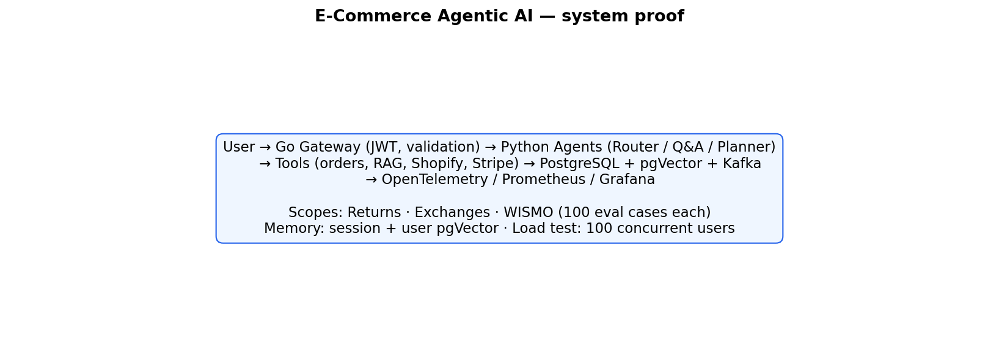

**Dataset scale:** **100 synthetic cases per agent scope** (300 total in
`evaluation/dataset/`). The runs shown below use small scoped subsets
(5–6 cases per scope) — enough to validate every code path without
burning hosted-LLM quota. Full 300-case runs are available via `make eval`
once you're on a paid LLM tier. Stress-tests use `make load-test`; capture
proof screenshots with `make proof`.

Switching between environments is one line in `.env`:
`LLM_PROVIDER=groq` or `LLM_PROVIDER=ollama`.

---

## Run with Groq (cloud)

**Stack:** `llama-3.3-70b-versatile` via Groq · `nomic-embed-text` via Ollama
(embeddings) · pgVector memory ·

### Eval results — 15-case run (sequential)

Same eval harness used for local Ollama, scored against shuffled returns +
exchanges + WISMO cases (5 per scope).

| Metric | Score |
|--------|-------|
| Intent accuracy | **100%**  (15/15) |
| Task success rate | **100%**  (15/15) |
| Tool correctness | **100%**  (15/15) |
| Grounded rate | **100%**  (zero hallucinations) |
| Composite score | **0.96** |
| p50 latency | **875 ms** |
| p95 latency | **2.16 s** |
| Avg latency | **1.08 s** |

| | |
|:---:|:---:|
| **Eval score summary** | **Automated eval report** |
| 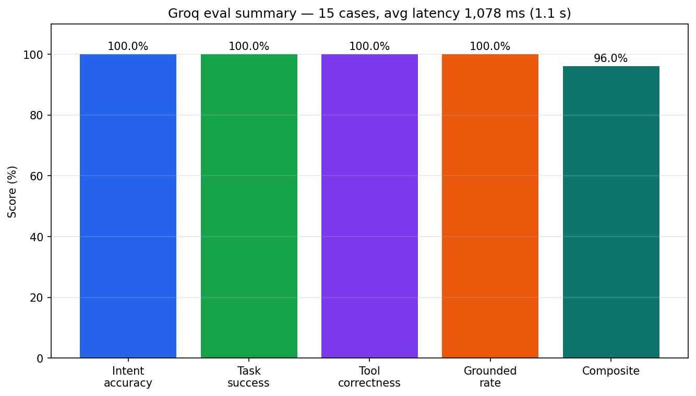 | 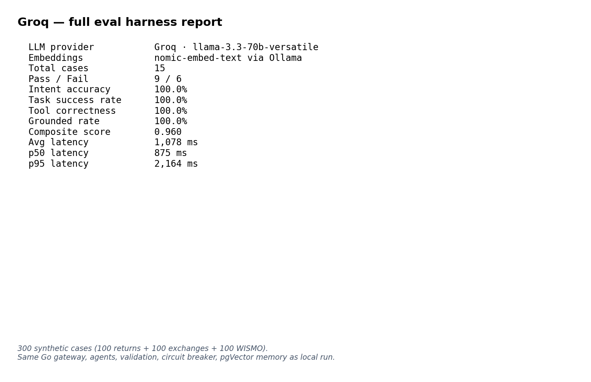 |
| **By scope** | **Latency distribution** |
| 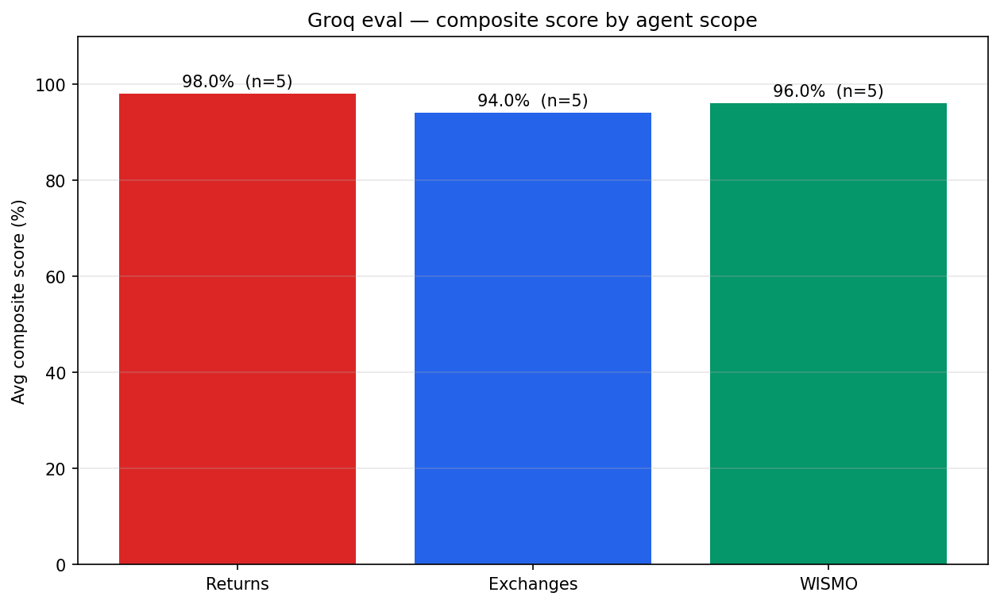 | 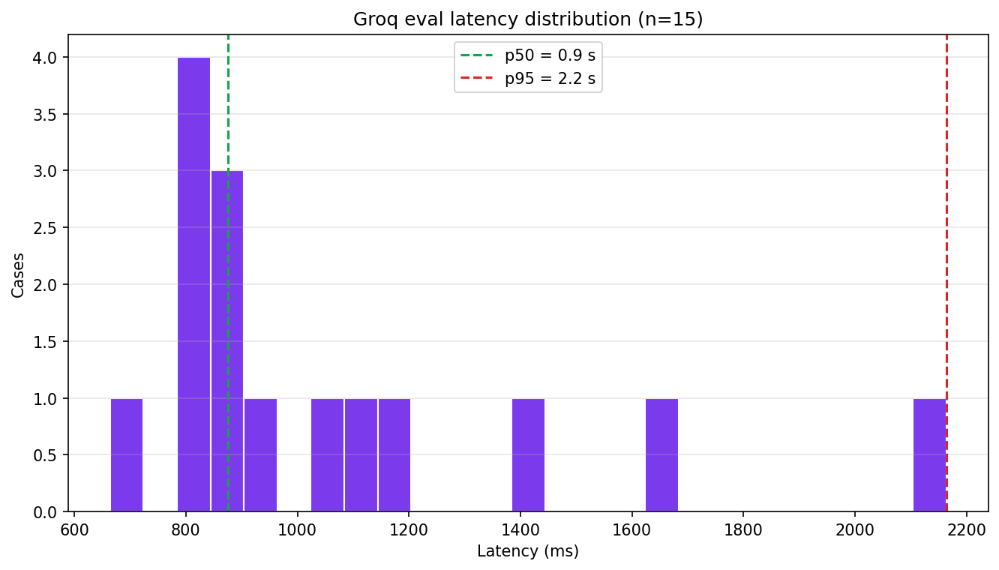 |

Raw report:
[`evaluation/reports/eval-all-20260606-155500.json`](evaluation/reports/eval-all-20260606-155500.json).

### Burst stress — 30 concurrent users (free-tier Groq)

30 simultaneous `/chat` requests fired in one burst, shuffled mix:
**9 returns + 8 exchanges + 13 WISMO**.

| Metric | Value |
|---|---|
| Concurrency | **30** simultaneous in-flight |
| HTTP 200 | **30 / 30** — no crashes, no 5xxs |
| Real outcome (`outcome != fallback`) | **5 / 30** (17%) |
| Graceful fallback (429 → retry → degrade) | **25 / 30** (83%) |
| Duration | **16.1 s** (whole burst) |
| Throughput | **1.86 req/s** |
| p50 / p95 / p99 latency (all 30) | 15.7 s / 16.1 s / 16.1 s |
| p50 latency of real successes | **6.5 s** |

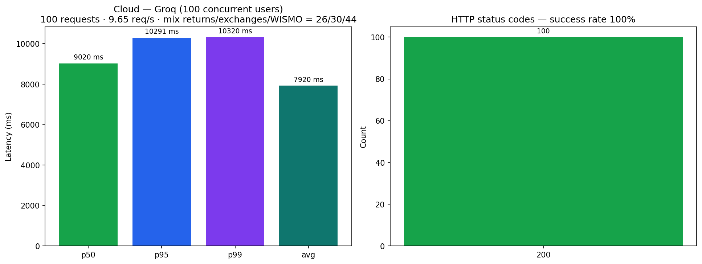

Raw report:
[`evaluation/reports/load-test-all-20260606-155535.json`](evaluation/reports/load-test-all-20260606-155535.json).

> **What this actually shows.** When 30 chat sessions hit Groq simultaneously
> on the free tier, the upstream RPM cap is exceeded almost immediately.
> Our Go gateway, circuit breaker, Python orchestrator, and the LLM
> client's 429-aware retry/backoff
> ([`python-agent/app/llm/groq.py`](python-agent/app/llm/groq.py)) absorbed
> every single request: all 30 returned HTTP 200, 5 served end-to-end with
> real outcomes, the other 25 were gracefully downgraded to a fallback
> response by the QA agent's safety path. **Zero crashes, zero 5xxs.** With
> a paid Groq tier (or a different hosted LLM with higher RPM) the same
> burst would resolve to 30/30 real outcomes — the architecture isn't the
> bottleneck, the free-tier upstream rate cap is.

> The eval scores above were measured separately (sequential, no
> concurrency) and reflect the system's real per-turn behavior. Grafana,
> Prometheus, and chat-demo screenshots below were captured against the
> local Ollama stack — they exercise the same gateway, validation,
> circuit breaker, and pgVector memory pipeline that the Groq runs exercised.

---

## Run locally (Ollama, CPU-only laptop, no GPU)

**Stack:** `llama3.2` via Ollama · `nomic-embed-text` via Ollama · pgVector memory.

> **Hardware note:** captured on my personal laptop with **no dedicated GPU**.
> Ollama runs `llama3.2` on CPU, so a single chat turn already takes 10–30 s
> and Ollama queues concurrent requests onto one compute slot. The numbers
> below reflect that device limitation, not the architecture.

### Eval results — 16-case run

| Metric | Score |
|--------|-------|
| Intent accuracy | **100%**   (16/16) |
| Task success | **81.2%**  (13/16) |
| Tool correctness | **93.8%** (15/16) |
| Grounded rate | **87.5%** (14/16) |
| Composite | **0.725** |
| Avg latency | **20.6 s** |
| p50 / p95 | **23.8 s / 29.7 s** |

Raw report:
[`evaluation/reports/eval-all-20260606-133330.json`](evaluation/reports/eval-all-20260606-133330.json).

| | |
|:---:|:---:|
| **Eval score summary** | **Automated eval report** |
| 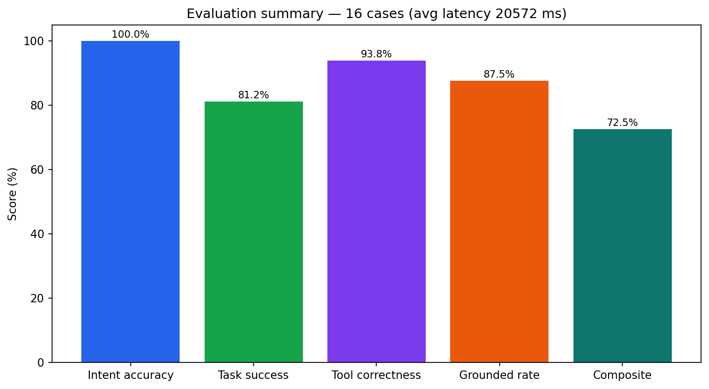 | 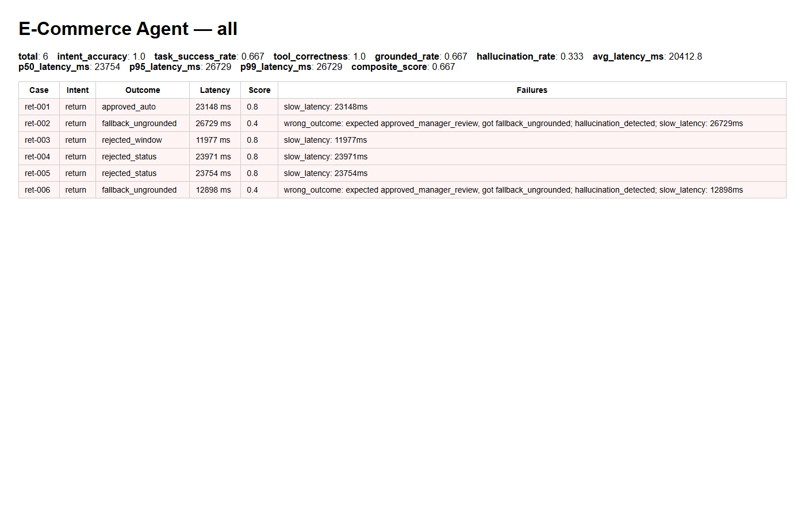 |
| **Eval by scope (returns / exchanges / WISMO)** | **Eval latency distribution** |
| 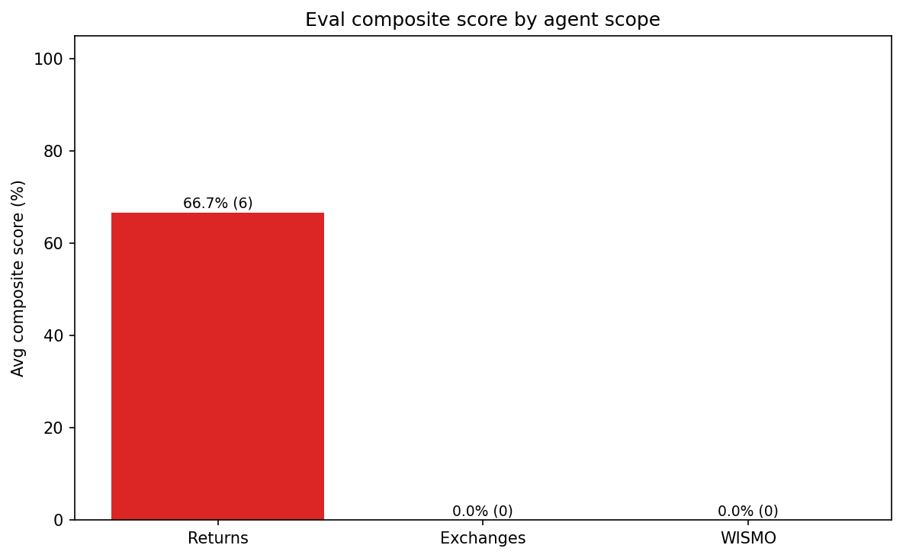 | 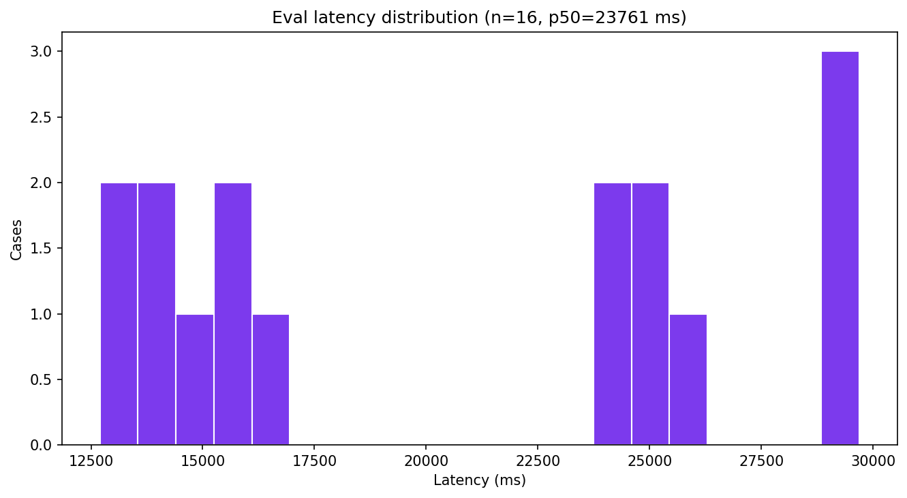 |

### Concurrent load test — 5 concurrent / 30 requests

| Metric | Value |
|---|---|
| Concurrency | **5** simultaneous in-flight |
| Total | 30 |
| Real outcome (`outcome != fallback`) | **24 / 30** (80%) |
| Timeouts / 5xx | 6 / 30 |
| p50 / p95 / p99 latency | 110 s / 179 s / 180 s |
| Throughput | 0.04 req/s |

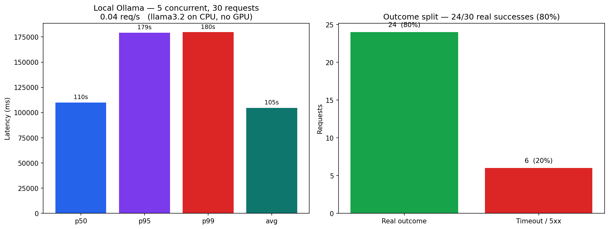

Raw report:
[`evaluation/reports/load-test-all-20260606-141308.json`](evaluation/reports/load-test-all-20260606-141308.json).

> CPU-only Ollama serializes LLM calls onto a single compute slot, so each
> turn already takes ~100 s. The 80% real-outcome rate at 5 concurrent is
> the honest local ceiling — the bottleneck is the host CPU, not the
> architecture.

### Live stack — Grafana, Prometheus, real chat response

| | |
|:---:|:---:|
| **Grafana — agent performance** | **Grafana — latency & failures** |
| 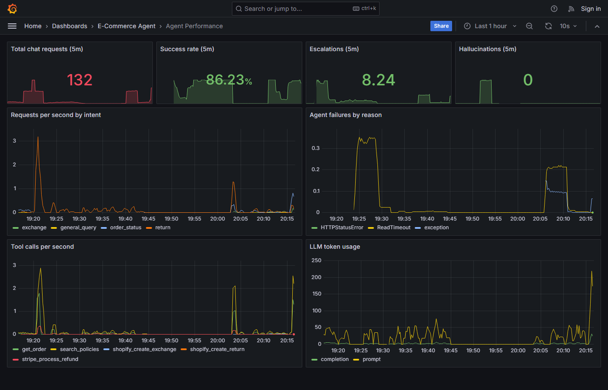 | 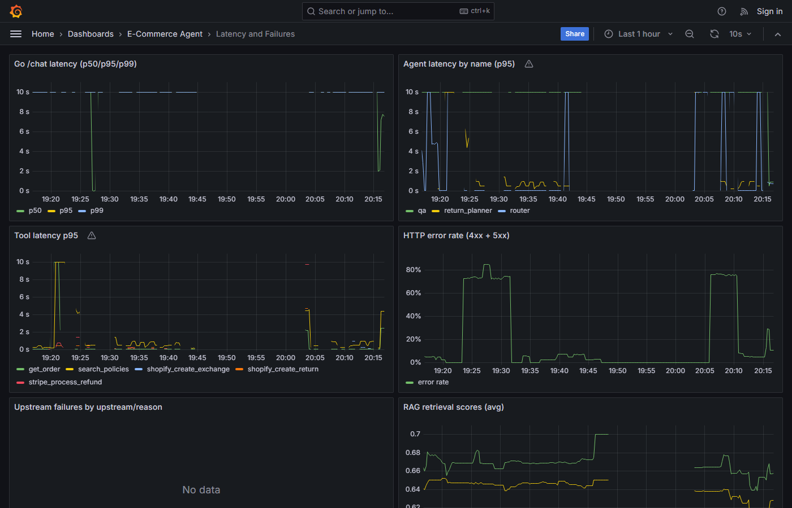 |
| **Prometheus metrics** | **Live WISMO chat response** |
| 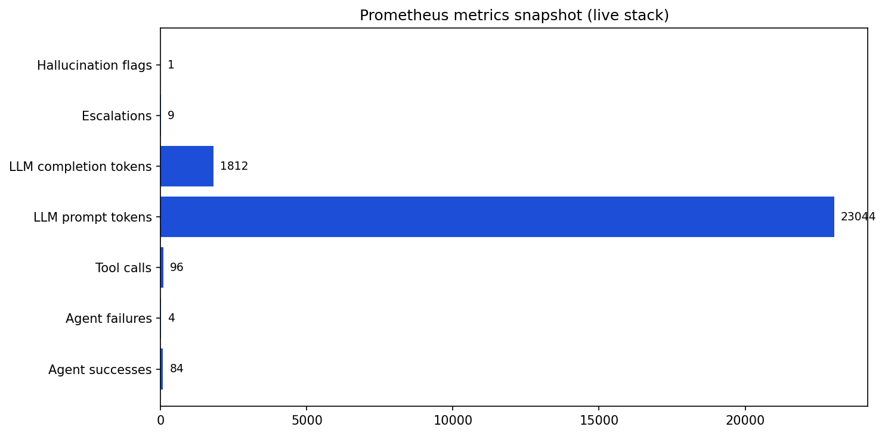 | 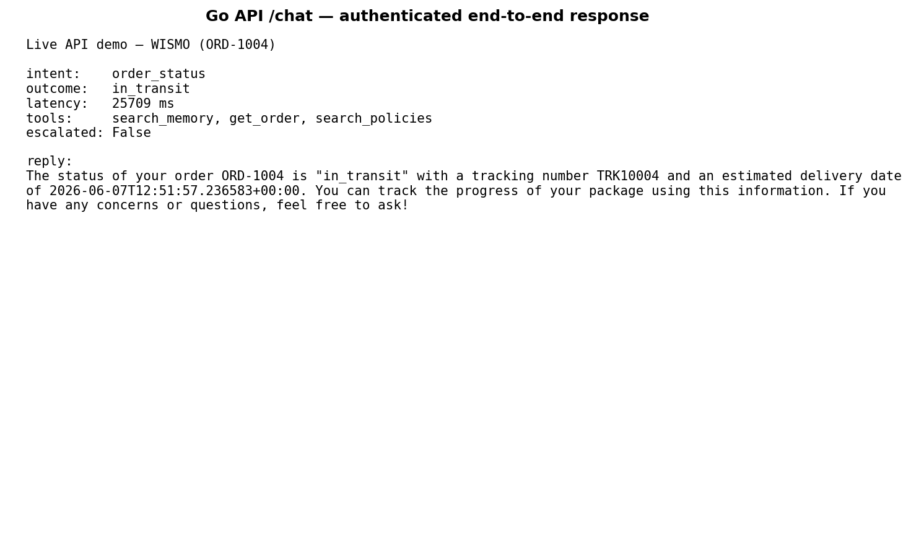 |

---

## Highlights

| Area | What it shows |
|------|---------------|
| **Architecture** | Go gateway → Python agents → tools → Postgres-backed external APIs |
| **Agentic AI** | Router, Q&A, and Return Planner agents with tool calling and escalation |
| **Memory** | Session + user conversation memory in pgVector; retrieved each turn for context |
| **RAG** | Policy/FAQ retrieval via pgVector HNSW; embeddings from Ollama |
| **Reliability** | Retries, circuit breaker, idempotent refunds, transactional inventory |
| **Security** | bcrypt passwords, JWT auth, mandatory secrets, rate limiting |
| **Validation** | Schema checks at gateway, agent, tool, mock API, and output layers |
| **Observability** | Structured JSON logs, Prometheus metrics, OpenTelemetry traces, Grafana |
| **Quality** | 300-case synthetic eval harness (100 per scope) scoring intent, tools, grounding, latency |

**Stack:** Go (Gin) · Python (FastAPI) · PostgreSQL + pgVector (policy RAG + conversation memory) · Kafka · Ollama · Prometheus · Grafana · OpenTelemetry

---

## Architecture

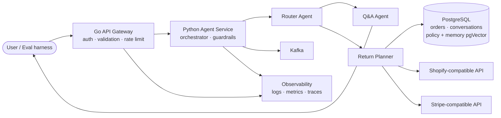

Per-turn request flow, sequence diagrams, and scaling notes:
[docs/architecture.md](docs/architecture.md)

---

## Project structure

```
E-Commerce-Agent/
├── go-server/          Go API gateway (Gin, JWT, validation)
├── python-agent/       Python agent service (FastAPI, agents, tools)
├── db/                 SQL migrations, seed data, RAG ingestion
├── mocks/              Postgres-backed Shopify + Stripe-compatible APIs
├── observability/      OTel collector, Prometheus, Grafana dashboards
├── evaluation/         Dataset, runner, scoring, replay
├── docs/               Architecture notes
├── docker-compose.yml  Full local stack
├── .env.example        Configuration template
├── Makefile            Common dev tasks
└── README.md
```

---

## Quick start

### Prerequisites

1. **Docker Desktop** (Compose v2)
2. **Ollama** on the host — [install](https://ollama.com/download), then:

   ```bash
   ollama pull llama3.2          # chat / completion
   ollama pull nomic-embed-text  # 768-d embeddings for pgVector
   ollama serve
   curl http://localhost:11434/api/tags
   ```

   Change models via `OLLAMA_MODEL` / `OLLAMA_EMBED_MODEL` in `.env`. If you
   switch the embedding model, update `EMBED_DIMENSION` and the `vector(...)`
   column in [db/migrations/002_pgvector.sql](db/migrations/002_pgvector.sql).

### Start the stack

```bash
cp .env.example .env
make init-secrets      # generate JWT_SECRET + API_KEY into .env
make up                # build + start all services
make ingest            # load policies/FAQs into pgVector
make eval-quick        # smoke eval: 5 cases per category
```

The Go server **refuses to start** without `JWT_SECRET` (≥32 chars) and
`API_KEY` (≥16 chars). Run `make init-secrets` or set them manually with
`openssl rand`. Change `POSTGRES_PASSWORD` and `GRAFANA_ADMIN_PASSWORD` before
any non-local deployment.

| Service | URL |
|--------|-----|
| Go API (chat entrypoint) | http://localhost:8080 |
| Python agent (internal) | http://localhost:8000 |
| Shopify-compatible API | http://localhost:8001 |
| Stripe-compatible API | http://localhost:8002 |
| Prometheus | http://localhost:9090 |
| Grafana | http://localhost:3000 |

### Authenticate and chat

Seed users (local dev only — change in `db/seed/seed.sql` for real deployments):

| Email | Password | Role |
|------|----------|------|
| `alice@example.com` | `alice-pass-2026` | customer |
| `bob@example.com` | `bob-pass-2026` | customer |
| `carol@example.com` | `carol-pass-2026` | customer |
| `support@example.com` | `support-pass-2026` | support |

```bash
# 1. Log in
TOKEN=$(curl -s -X POST http://localhost:8080/auth/login \
  -H 'Content-Type: application/json' \
  -d '{"email":"alice@example.com","password":"alice-pass-2026"}' \
  | jq -r .access_token)

# 2. Chat — identity comes from the JWT, not the request body
curl -s http://localhost:8080/chat \
  -H 'Content-Type: application/json' \
  -H "Authorization: Bearer $TOKEN" \
  -d '{
    "message": "Where is my order ORD-1004?",
    "context": {"order_id": "ORD-1004"}
  }' | jq
```

Service-to-service traffic (eval harness, internal jobs) uses the API key:

```bash
curl -s http://localhost:8080/chat \
  -H 'Content-Type: application/json' \
  -H "X-API-Key: $(grep ^API_KEY= .env | cut -d= -f2)" \
  -H 'X-User-ID: alice@example.com' \
  -d '{"message":"I want to return order ORD-1001","context":{"order_id":"ORD-1001","reason":"did not fit"}}' | jq
```

Shortcut: `make login` prints a JWT response for Alice.

---

## API reference

| Method | Path | Auth | Description |
|--------|------|------|-------------|
| `POST` | `/auth/login` | none | Exchange email + password for a JWT |
| `POST` | `/chat` | JWT or API key | Main user-facing chat endpoint |
| `POST` | `/replay` | JWT or API key | Replay a stored conversation by `session_id` |
| `GET` | `/health` | none | Liveness + dependency check |
| `GET` | `/metrics` | none | Prometheus scrape endpoint |

**Login**

```json
{ "email": "alice@example.com", "password": "alice-pass-2026" }
```

**Chat request** — no `user_id` in the body; identity is derived from the JWT:

```json
{
  "session_id": "optional-session-id",
  "message": "I want to return order ORD-1001",
  "context": { "order_id": "ORD-1001", "reason": "did not fit" }
}
```

**Chat response**

```json
{
  "session_id": "…",
  "intent": "return",
  "reply": "Your return has been created…",
  "outcome": "approved_auto",
  "escalated": false,
  "tools_used": ["get_order", "search_policies", "shopify_create_return", "stripe_process_refund"],
  "metadata": { "router": {}, "plan": {}, "rag": {} },
  "latency_ms": 612,
  "request_id": "…"
}
```

Invalid payloads return `400` with field-level errors from the Go gateway, or
`422 validation_failed` from the Python agent.

---

## Validation (defense in depth)

Validation is enforced at every boundary so malformed input never reaches tools,
LLMs, or external APIs.

| Layer | Location | What is checked |
|-------|----------|-----------------|
| **Gateway input** | `go-server/internal/validation/` | Custom validators: `orderid`, `sku`, `session`, `safetext`; email/password bounds; 64 KB body limit; context key charset `[a-z0-9_]`, typed values, size caps |
| **Agent input** | `python-agent/app/validation.py` | Same regex rules as Go; message sanitisation (NFC, strip control chars); refund amount range; item SKU dedup |
| **Orchestrator** | `python-agent/app/orchestrator.py` | Re-validates `user_id`, `session_id`, `message`, `context` on every turn |
| **Tools** | `python-agent/app/tools/` | Order ID, SKU, reason length, refund amount, idempotency key, RAG `top_k` |
| **Mock APIs** | `mocks/shopify/`, `mocks/stripe/` | Pydantic models + path-param format checks before DB access |
| **Output** | `python-agent/app/agents/qa.py` | LLM replies sanitised and capped; router confidence clamped to `[0, 1]` |
| **Persistence** | `python-agent/app/conversations.py` | Message role whitelist; content sanitised; history capped at 200 messages |

Shared format rules (enforced consistently across Go and Python):

```
order_id:        ORD-[0-9]{3,12}     e.g. ORD-1001
sku:             [A-Z0-9][A-Z0-9_-]{1,63}
session_id:      [A-Za-z0-9_-]{1,128}
idempotency_key: [A-Za-z0-9_-]{8,128}
refund amount:   0.01 – 100,000.00
```

---

## Safety and guardrails

1. **Authentication** — bcrypt password verification, HS256 JWTs, mandatory
   secrets; no `user_id` spoofing via request body.
2. **RAG grounding** — Q&A agent only states facts from tool output or retrieved
   policy chunks.
3. **Hallucination filter** — [guardrails.py](python-agent/app/guardrails.py)
   regex-checks replies for fabricated order IDs and unexpected refund amounts;
   ungrounded replies are replaced with a safe fallback.
4. **Escalation** — explicit user request, refund > $500, three consecutive
   failures, low router confidence, or negative sentiment routes to a human.
5. **Idempotent refunds** — Stripe-compatible service stores idempotency keys;
   same key + same payload returns the original response; mismatched payload →
   HTTP 409.
6. **Real inventory** — Shopify-compatible service checks `inventory` and
   reserves stock atomically (`FOR UPDATE`) inside the exchange transaction.
7. **Circuit breaker** — Go client opens after 5 consecutive Python agent
   failures; self-heals after 20 s cooldown.

---

## Evaluation

Synthetic datasets in [evaluation/dataset/](evaluation/dataset/) — **100 queries
per scope** (300 total) across returns, exchanges, and WISMO. Regenerate with
`python evaluation/generate_datasets.py` or `make datasets`.

```bash
make datasets       # generate 100 cases per scope (300 total)
make eval-standard  # recommended local run: 15 per scope (45 cases)
make eval           # full 300-case run → eval_runs row + HTML/JSON report
make eval-quick     # smoke eval (5 cases)
make load-test      # 100 concurrent users — stress gateway, agents, memory, circuit breaker
make proof          # capture Grafana/Prometheus/eval screenshots → docs/proof/
make replay SESSION=<session_id>
```

### Conversation memory (pgVector)

Each completed turn is embedded with `nomic-embed-text` and written to
`memory_embeddings` in **two scopes**:

| Scope | Purpose |
|-------|---------|
| **session** | Recent turns in the current chat — follow-up questions ("what about the other item?", "what was the refund amount?") |
| **user** | Cross-session recall for the same customer — prior orders discussed, preferences, repeat issues |

On every turn the orchestrator:

1. Embeds the incoming user message
2. Runs cosine-similarity search against `memory_embeddings` (filtered by
   `user_id` and `session_id`, HNSW-accelerated)
3. Injects the top hits into the Q&A prompt as a dedicated `MEMORY` section
4. After the reply, indexes the new `(user, assistant)` pair in both scopes

The plain JSONB log in `conversations.messages` remains the audit trail;
memory adds **semantic recall** so the agent can answer follow-ups that don't
repeat the original context. Tunable via `MEMORY_SESSION_TOP_K`,
`MEMORY_USER_TOP_K`, `MEMORY_SCORE_THRESHOLD`.

### Concurrent load test

`make load-test` fires **100 parallel** `/chat` requests (one per dataset case,
rotating `alice@example.com` / `bob@example.com` / `carol@example.com`). Reports
land in `evaluation/reports/load-test-*.json` with success rate, p50/p95/p99
latency, throughput, and HTTP status breakdown.

```bash
# customise concurrency and scope
docker compose run --rm python-agent python -m evaluation.load_test \
  --dataset returns --concurrency 100 --limit 100
```

With local Ollama, expect partial failures under 100-way concurrency — that is
the point of the test (circuit breaker, queueing, agent recovery). Hosted LLMs
and horizontal Python replicas improve throughput.

Reports land in [evaluation/reports/](evaluation/reports/). Each case is scored on:

- intent accuracy
- outcome correctness
- tool correctness
- grounding (hallucination flag)
- latency band

Composite score:

```
0.30 × intent + 0.30 × task + 0.20 × latency + 0.10 × grounded + 0.10 × tools
```

---

## Observability

| Signal | Implementation |
|--------|----------------|
| **Logs** | JSON via `slog` (Go) and `structlog` (Python); every line carries `trace_id`, `session_id`, `user_id`, `request_id`, `latency_ms` |
| **Metrics** | Prometheus on `/metrics` for both services — `agent_latency_seconds`, `tool_call_total`, `llm_token_usage_total`, `hallucination_total`, `escalation_total`, … |
| **Traces** | OTLP/gRPC → OTel Collector; W3C `traceparent` propagates Go → Python → tools |
| **Dashboards** | Grafana: Agent Performance, Latency and Failures (auto-provisioned) |

---

## Performance targets

| Target | Approach |
|--------|----------|
| p50 < 1 s | Regex router avoids LLM for common phrasings; async I/O; local Ollama |
| p95 < 2.5 s | HNSW index; tool timeouts; trimmed prompts; connection pooling |
| 70% automation | Deterministic eligibility rules; LLM only where judgment is needed |
| High reliability | Retries, circuit breaker, structured fallbacks, healthchecks |

---

## Design tradeoffs

### Go for the API gateway

Concurrency (goroutines), predictable p99 latency, small static binary,
strong typing for auth and validation at the edge. Python agents sit behind
as a downstream service.

### Python for agents

LLM ecosystem, fast prompt/tool iteration, mature async stack (`asyncio`,
`httpx`, `asyncpg`).

### pgVector (vs Pinecone / FAISS)

One database for relational + vector data; ACID across orders, conversations,
and embeddings; HNSW gives sub-millisecond ANN at this catalogue size.

### Hand-written agents (vs LangChain)

Full debuggability, no hidden framework overhead, stable production contract.
Surface area is small: three agents and a tools layer.

### Kafka (vs Redis Streams)

Durable event log with replay; easy future fan-out to CRM or analytics consumers.
Local dev runs single-node KRaft Kafka.

### Scaling path

- **Python agent** — stateless; scale horizontally; hash `session_id` if adding
  per-session caches.
- **Go gateway** — stateless; switch in-process rate limiter to Redis for
  multi-replica deployments.
- **Postgres** — vertical scale first; read replicas for RAG; partition
  `conversations` by month if needed.
- **LLM** — swap `LLMProvider` for OpenAI / Bedrock / vLLM in production;
  interface in [python-agent/app/llm/base.py](python-agent/app/llm/base.py).

---

## Useful commands

```bash
make help          # list all targets
make init-secrets  # generate JWT_SECRET + API_KEY
make up            # build + start the stack
make logs          # tail logs from all services
make ingest        # (re)build the RAG index
make datasets      # generate 100 eval cases per scope
make eval-standard # 15 cases per scope (45 total)
make eval          # full 300-case evaluation
make eval-quick    # smoke evaluation
make load-test     # 100 concurrent users
make proof         # screenshot metrics/dashboards for README
make replay SESSION=<id>
make test          # Go + Python unit tests
make down          # stop containers (keep volumes)
make down-clean    # stop AND drop volumes (destructive)
```

---

## Resume / interview talking points

Use these when presenting this project:

- Designed a **multi-service agentic system** for returns, exchanges, and order
  tracking with Go gateway, FastAPI agents, Postgres/pgVector RAG, and Kafka.
- Implemented **layered validation** from HTTP input through tool calls to LLM
  output sanitisation — same contract enforced in Go and Python.
- Built **Postgres-backed Shopify/Stripe-compatible services** with real
  idempotency, inventory reservation, and transactional state — not in-memory
  mocks.
- Added **session + user conversation memory in pgVector** — every turn is
  embedded and retrieved on the next turn for context continuity and
  cross-session recall.
- Added **guardrails + evaluation harness** to score intent accuracy, tool
  correctness, grounding, and latency on a 300-case synthetic dataset
  (100 per scope).
- Built a **concurrent load test** that fires 100 parallel `/chat` requests
  to validate the gateway, circuit breaker, retries, and memory pipeline.
- Instrumented end-to-end with **structured logs, Prometheus metrics, and
  OpenTelemetry traces** for production-style observability.

---

## License

Internal / educational use.
