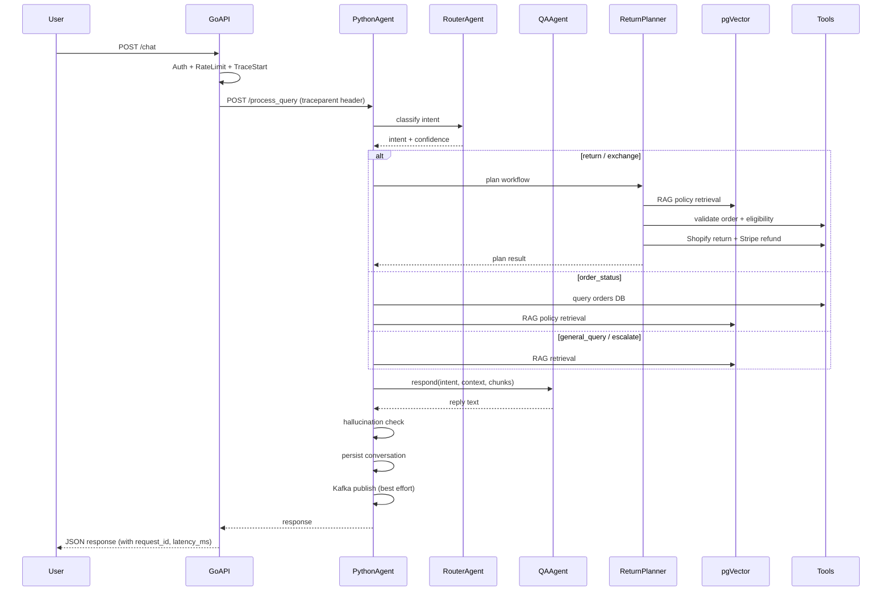
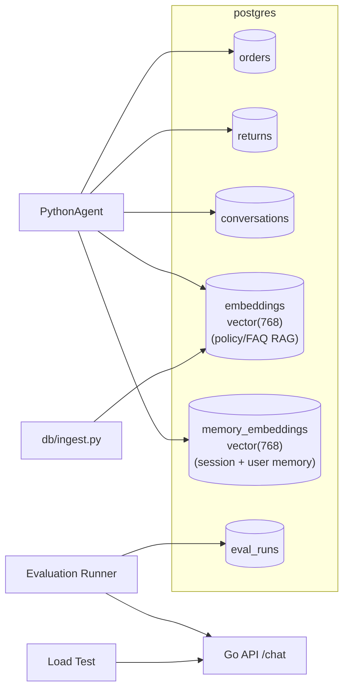

# Architecture Notes

This document complements the top-level [README](../README.md) with deeper
design rationale, sequence diagrams, and failure modes.

## 1. End-to-end sequence



## 2. Component responsibilities

### Go API Gateway

* Transport — JSON over HTTP/1.1; HTTP/2 ready via Gin.
* **Real auth** — `POST /auth/login` validates email + password against the
  users table with bcrypt (`golang.org/x/crypto/bcrypt`) and issues a signed
  JWT. Constant-time comparison is used everywhere to avoid timing oracles.
* Cross-cutting concerns — request ID, structured logging, OTel trace start,
  Prometheus metrics, per-identity token-bucket rate limiting.
* Resilience — exponential-backoff retries (max 3) and a 5-failure
  circuit breaker around the Python agent.
* Reads users for login, writes nothing else — purely a hardened proxy.

### Python Agent Service

* **Router agent** — fast regex rules, then LLM JSON classifier. Two-stage
  design to keep latency low.
* **Q&A agent** — final user-facing message generation. Receives a tightly
  scoped `context` dict so the LLM cannot invent facts.
* **Return planner** — deterministic eligibility rules + RAG-grounded
  rationale + side-effecting tool calls (Shopify return, Stripe refund).
* **Orchestrator** — single entrypoint per turn; persists the conversation
  and emits Kafka events.

### Tools

| Tool | Purpose |
|------|---------|
| `get_order` | Read order row from Postgres |
| `list_user_orders` | List recent orders for a user |
| `search_policies` | pgVector cosine similarity search (HNSW) |
| `shopify_create_return` | Mock Shopify RMA |
| `shopify_create_exchange` | Mock Shopify exchange |
| `stripe_process_refund` | Mock Stripe refund with idempotency key |

All tools are wrapped by `@tool(name)` which adds Prometheus counters/histograms
and an OTel span automatically.

## 3. Failure modes and mitigations

| Failure | Mitigation |
|---------|-----------|
| Bad credentials | Constant-time bcrypt comparison; identical 401 for "user not found" and "wrong password" to prevent enumeration. |
| Stolen/expired JWT | HS256 signature + `exp` + `iss` checks; expired tokens rejected with 401. |
| Python agent down | Go circuit breaker opens; client gets a clean 502 with `request_id`. |
| LLM timeout | Tenacity retries (3, exp backoff); falls back to canned reply per intent. |
| RAG returns nothing relevant | `chunks` empty; Q&A says it lacks information and offers escalation. |
| Shopify rejects exchange (out of stock) | `inventory.stock_quantity = 0` short-circuits before reservation; planner returns `exchange_out_of_stock`. |
| Stripe idempotency-key reuse with different payload | Service returns HTTP 409; agent retries surface as `agent_failure_total{reason="HTTPStatusError"}`. |
| Hallucination (fabricated order id / amount) | `check_grounding` overrides the reply with a safe fallback; counter incremented. |
| Repeated user failures | Orchestrator counts `consecutive_failures` in metadata; threshold triggers escalation. |
| Kafka down | `EventPublisher.publish()` logs at WARN; the user request still succeeds. |
| Postgres down | Health endpoint reports degraded; new chats fail fast with 502; Go server refuses to start at boot if it cannot ping. |

## 4. Data flow



## 5. Why each technology — short version

* **Go (Gin)** — predictable tail latency, easy deployments, single binary.
* **Python (FastAPI)** — best LLM/ML ecosystem and fast iteration on agents.
* **pgVector** — one database for relational + vector; ACID; cheap to operate.
  Used for both policy/FAQ RAG and per-user / per-session conversation memory.
* **Kafka** — durable event log for audit/replay; ready for downstream
  consumers (CRM, analytics) without rework.
* **Ollama** — local, free, swappable. Production deployments can switch the
  `LLMProvider` in `python-agent/app/llm/` without changing agent code.

## 6. Local dev cheat sheet

```bash
make up           # build + start everything
make ingest       # populate the RAG index
make eval-quick   # smoke test
make logs         # follow logs
make down-clean   # nuke volumes
```

## 7. Open extensions (future work)

* Streaming responses (SSE) from Go → Python → LLM.
* Multi-tenant RBAC at the Go layer.
* Online evaluation: sample 1% of live traffic into an evaluation queue.
* Swap Ollama for vLLM behind the same `LLMProvider` interface.
